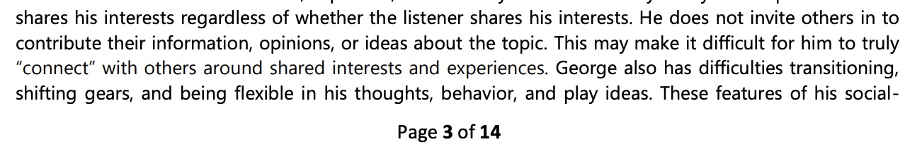
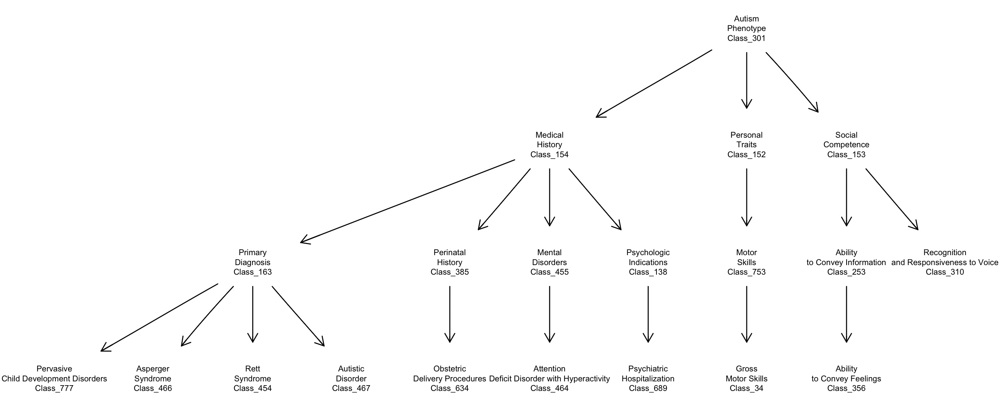

# llm4np: LLM applications for neuropsychological (NP) evaluation reports

## Basic concept

Here is an excerpt from a [demonstrative NP evaluation](https://www.thepeerconsult.com/_files/ugd/38c21a_34d817a3c29c43019ea07630ac486230.pdf) on a public website:

This package addresses the use of LLM technology to parse and tag the
content of NP reports and to thereby enable the extraction of
quantitative and qualitative features in a standardized and
objective way.

A basic concern is to understand the potential role of ontologies
of symptoms and behaviors related to the neuropsychological evaluation
of individuals presenting with Autism Spectrum Disorder.  Several
ontologies have been developed in this area.  An excerpt from
[a 2014 submission to NCBO](https://bioportal.bioontology.org/ontologies/ASDPTO)
is

The publication underlying this ontology is in [pubmed central](https://pmc.ncbi.nlm.nih.gov/articles/PMC4000751/).
